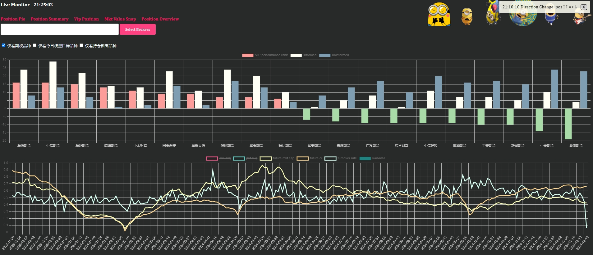
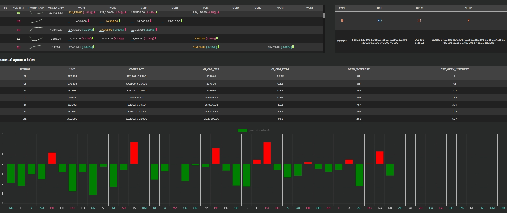
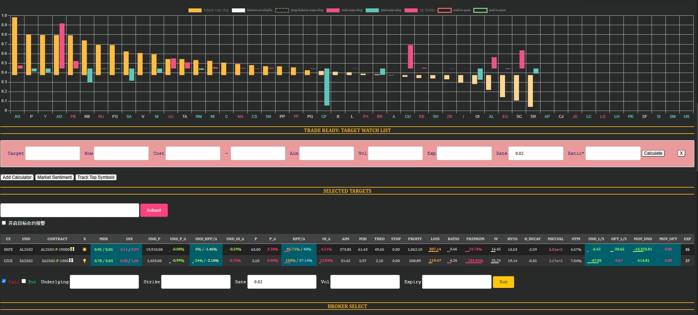
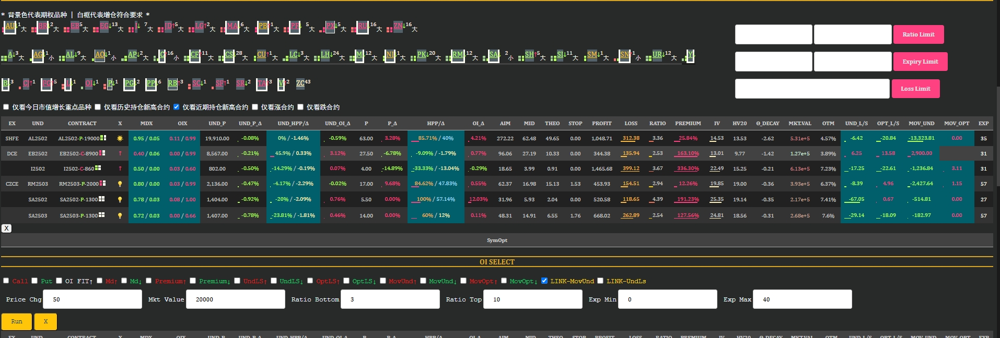
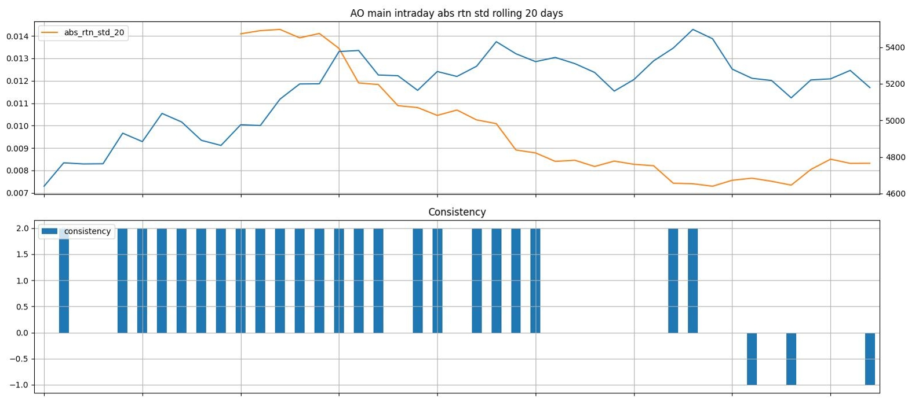
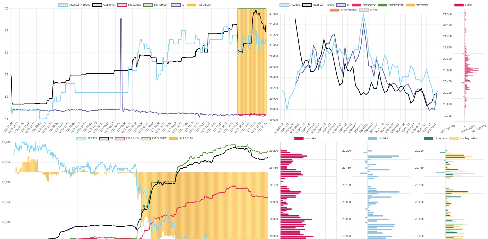

    经过一个令人沮丧的2024年，相信各位已经认识到国内期货自从2023年底的缩量之后，其交易生态已经大幅改变，投机交易的机会也在今年大幅萎缩。
    所以这样一个分析商品期货数据，挖掘买方期权交易机会的项目已经无用武之地，不如分享出来给有学习研究需要的朋友。
    
    **本项目是从另一个量化交易项目中移植而来，所以底层有些配置涉及到多数据源应用层、实时交易等。实际使用中不需要特殊配置这些内容，不影响使用。
    
    PREREQUISITE: 
        1. 你需要首先配置MONGODB, CLICKHOUSE, REDIS作为历史数据库、实时数据库、数据交换层
        2. 你需要chromedriver作为获取历史数据的基础
        3. 在config.ini中配置以上项目
        4. 在trade.ini中配置交易账户信息，由于本项目不涉及交易端，所以可以只用配置行情端的相关内容
        
    REQUIREMENT:
        1. python == 3.8.x
        2. OS REQ == WINDOWS 10/11
        
    
    HOW TO USE:
        项目根目录下有四个ps1文件：
            <盘后运行>
            update_data.ps1 -- 更新数据文件，每日固定运行时间为17：30 - 20：00
            update_model.ps1 -- 更新每日模型
            <盘中运行>
            start_statsX.ps1 -- 实盘中运行，用来获取实时数据并进行实时分析
            start_front_end_server.ps1 -- 数据前台

    主要功能包括：
        1. 品种多空参考
        2. 优势席位/劣势席位参考
        3. 期权分析：包含方向性的期权买方性价比分析，期权本身的premium分析
        4. 高性价比期权买权推荐
        5. 实时数据跟踪页面
        6. 期限结构历史及实时动态
        7. 期权计算器
        8. 期权盈亏比率计算器
        9. 期权unusual whale监控
        10. 价格成本偏移监控
        ...
        

    

